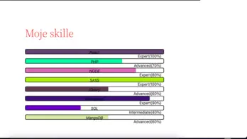

## Preview

#  Effective Progress Bar to display skills - Gutenberg pluggin app

Effective Progress Bar is the best responsive pluggin to display your skills.

## Main Features:

- Responsive & Mobile ready.
- Clean and intuitive admin panel.
- Multiple Progress Bars 
- Title and value of your skill
- Random background color to astonish readers
- Add or Remove rows. 
- Developer friendly & easy to customize.
- SEO friendly & optimized for speed.

### Tech Stack:
- [React JS](https://reactjs.org/docs/getting-started.html) v17.02 Bootstrapped with [Create React App](https://github.com/facebook/create-react-app).
- [PHP](https://www.php.net) 
- [Wordpress](https://wordpress.org)

### Instalation:
- download folder and install it as normal wordpress pluggin. 